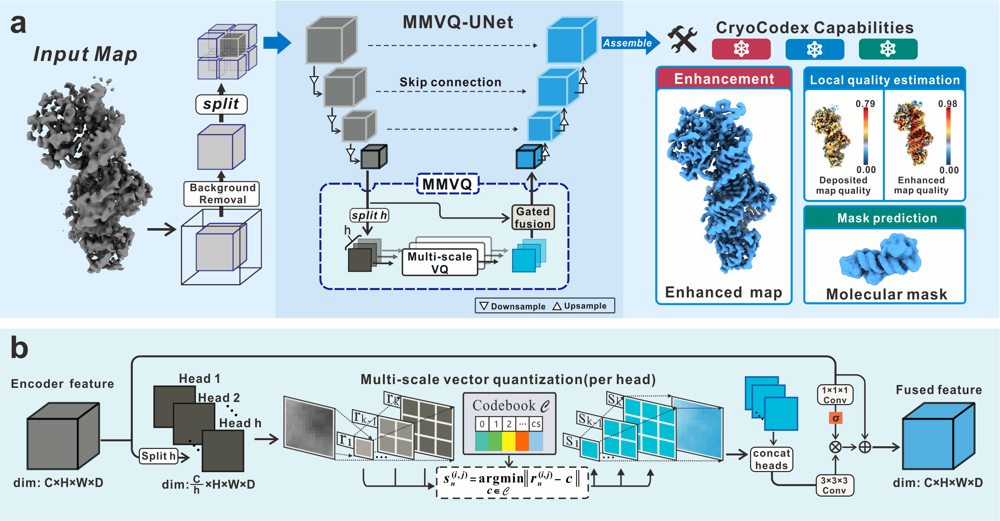
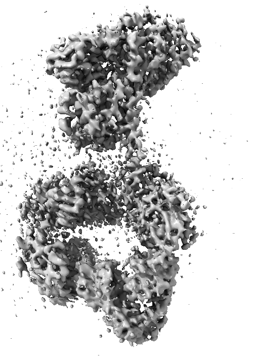
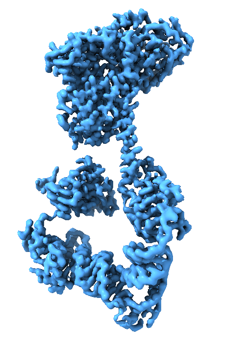
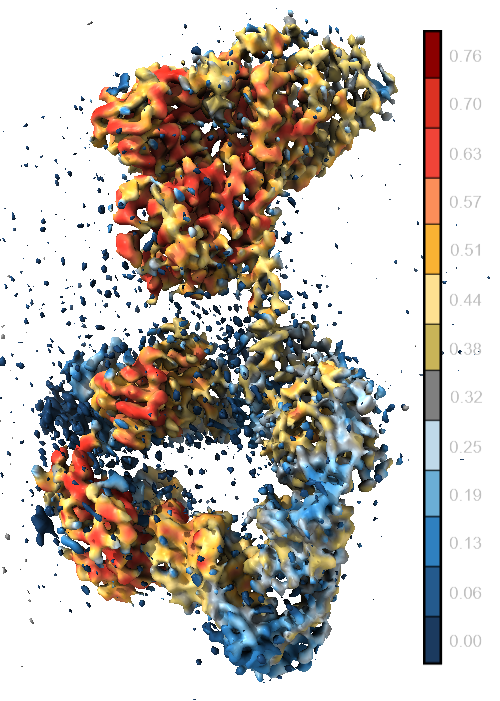
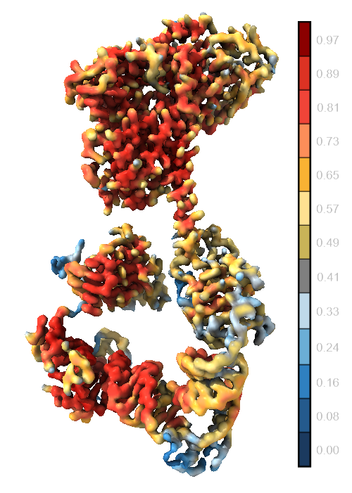
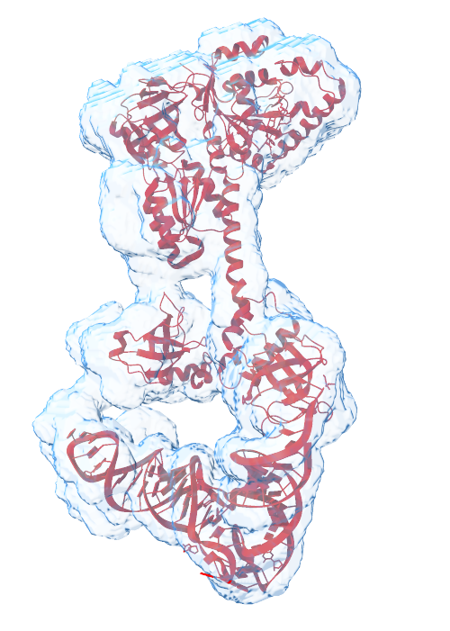

<div align="center">

# CryoCodex

<p>Version 1.0.0 · Python 3.11 · PyTorch 2.5.1 · CUDA 12.4</p>

### Cryo-EM map enhancement with local quality estimation and molecular mask prediction

<sub>Bin Cheng · Yang Lab</sub>

<br>



</div>

---

## Example results

The example below shows the original input density map and the four outputs produced by CryoCodex.

### Map enhancement

<div align="center">

<table>
<tr>
<td align="center" width="320" style="border: none;">
  <b>Input · Original density map</b>
  <br><br>
  
</td>

<td align="center" width="320" style="border: none;">
  <b>Output · Enhanced map</b>
  <br><br>
  
</td>
</tr>
</table>

</div>


### Local quality estimation

<div align="center">

<table>
<tr>
<td align="center" width="320" style="border: none;">
  <b>Output · Input map local quality</b>
  <br><br>
  
</td>

<td align="center" width="320" style="border: none;">
  <b>Output · Enhanced map local quality</b>
  <br><br>
  
</td>
</tr>
</table>

<p align="center">
  <sub>
    Blue indicates lower predicted local quality and red indicates higher predicted local quality.
    The two panels use different color-scale ranges; refer to the numerical color bars when comparing scores.
  </sub>
</p>

</div>


### Molecular mask prediction

<div align="center">

<table>
<tr>
<td align="center" width="320" style="border: none;">
  <b>Output · Predicted molecular mask</b>
  <br><br>
  
</td>
</tr>
</table>

<p align="center">
  <sub>
    The ribbon model is shown for reference and is not a CryoCodex output.
  </sub>
</p>

</div>

---

## Requirements

**Linux** · **CUDA-enabled GPU** · **Python 3.11** · [`requirements.txt`](requirements.txt)

<sub>Mainly tested on CentOS 7. For GPUs with limited memory, reduce the batch size using `-b`.</sub>

---

## Installation

<details>
<summary><b>Show installation instructions</b></summary>

<br>

### 1. Download CryoCodex

```bash
git clone https://github.com/YangLab-SDU/CryoCodex.git
cd CryoCodex
```

### 2. Create a conda environment

```bash
conda create -n cryocodex_env python=3.11
conda activate cryocodex_env
```

### 3. Install the packages

```bash
pip install -r requirements.txt
chmod +x predict.sh
```

### 4. Configure `predict.sh`

The following three variables are blank by default. Fill them in at the top of `predict.sh` before running; for example:

```bash
CryoCodex_home="/home/data/CryoCodex"
activate="/home/***/anaconda3/bin/activate"
CryoCodex_env="cryocodex_env"
```

| Variable           | Description                                                            |
| :----------------- | :--------------------------------------------------------------------- |
| `CryoCodex_home` | Directory where CryoCodex was downloaded                             |
| `activate`         | Path to the conda activation script                                    |
| `CryoCodex_env`  | Name of the conda environment holding the packages installed in Step 3 |

If you followed the commands above, set `CryoCodex_env="cryocodex_env"`. The model download URL is already configured.

> **Note:** Model weights are downloaded automatically on the first run of `predict.sh`.

Check the installation with:

```bash
./predict.sh -h
```

</details>

---

## Usage

<details open>
<summary><b>Basic command</b></summary>

<br>

```bash
./predict.sh -i in_map.mrc -o out_dir [Options]
```

For a standard run:

```bash
./predict.sh -i in_map.mrc -o out_dir
```

CryoCodex uses **Fast mode** by default.

</details>

<details>
<summary><b>Required arguments</b></summary>

<br>

| Argument | Description |
| :------- | :---------- |
| `-i MAP` | Input EM map (`.map` / `.mrc`) |
| `-o DIR` | Directory to save the output maps |

</details>

<details>
<summary><b>Options</b></summary>

<br>

| Option | Description | Default |
| :----- | :---------- | :-----: |
| `-n OUT_NAME` | Base name of the output maps | `cryocodex` |
| `-g GPU_ID` | Which GPU to run on, e.g. `0` | `0` |
| `-b BATCH_SIZE` | Number of boxes processed in one batch | `9` |
| `-s STRIDE` | Stride of the sliding window that cuts the input map into overlapping boxes | `12` |
| `--normal True\|False` | Infer on the whole map without cropping the background away | `False` |
| `--reverse_interpolation True\|False` | Resample the saved maps back to the voxel size of the input map | `False` |
| `--crop_check True\|False` | Fast mode only: review the cropped region before inference | `False` |
| `--keep_size True\|False` | Fast mode only: fill the cropped-away background back in with zeros so the outputs span the whole input map | `False` |
| `--no_logo True\|False` | Do not show the logo banner | `False` |
| `--version` | Print the version of CryoCodex and exit | — |

</details>

<details>
<summary><b>Command-line help</b></summary>

<br>

For command-line help:

```bash
./predict.sh -h            # Short option summary
./predict.sh -h advanced   # Full option list
```

</details>

---
## Inference Modes

CryoCodex provides two inference modes, selected with `--normal True|False`.

<details>
<summary><b>Inference mode details</b></summary>

<br>

<table>
<tr>

<td width="50%" valign="top">

<h3 align="center">Fast mode</h3>

<p align="center">
  <sub><b>Default · Cropped inference</b></sub>
</p>

Crops the background around the molecule away and performs inference only on the remaining region, making the run much quicker.

<pre><code>./predict.sh \
  -i in_map.mrc \
  -o out_dir</code></pre>

<b>Available options</b>

<p>
<code>--crop_check True</code><br>
<sub>Review the cropped region before inference.</sub>
</p>

<p>
<code>--keep_size True</code><br>
<sub>Fill the cropped-away background back in with zeros.</sub>
</p>

</td>

<td width="50%" valign="top">

<h3 align="center">Normal mode</h3>

<p align="center">
  <sub><b>Full-map inference</b></sub>
</p>

Performs inference on the whole map without cropping anything away.

<pre><code>./predict.sh \
  -i in_map.mrc \
  -o out_dir \
  --normal True</code></pre>

<b>Characteristics</b>

<p>
<code>Region</code><br>
<sub>Whole input map</sub>
</p>

<p>
<code>Speed</code><br>
<sub>Slower than Fast mode</sub>
</p>

<p>
<code>Crop options</code><br>
<sub>Not applicable</sub>
</p>

</td>

</tr>
</table>

</details>

<details>
<summary><b>Crop inspection</b> · <code>--crop_check True</code></summary>

<br>

Projection images of the cropped region are written to:

```text
out_dir/round_1_check/
```

The run then waits at the terminal:

|   Input   | Action                            |
| :-------: | :-------------------------------- |
| **Enter** | Continue with the current crop    |
|   **e**   | Edit the bounds of the three axes |

</details>

<details>
<summary><b>Preserve the original map size</b> · <code>--keep_size True</code></summary>

<br>

The cropped-away background is filled back in with zeros so that the outputs span the whole input map.

</details>

---

## Outputs

By default, CryoCodex saves the output maps on a **1.0 Å grid** in the directory specified by `-o`.

```text
out_dir/
│
├── cryocodex.mrc             # Enhanced map
├── cryocodex_out_score.mrc   # Local quality score of the enhanced map
├── cryocodex_in_mask.mrc     # Predicted molecular mask
└── cryocodex_in_score.mrc    # Local quality score of the input map
```

Use `--reverse_interpolation True` to resample the saved maps back to the voxel size of the input map.

### Local quality visualization

The predicted local quality maps can be visualized in **UCSF ChimeraX** by coloring a cryo-EM map according to the corresponding local quality scores.

For example, open the deposited map and its input quality map:

```text
#1   deposited map
#2   cryocodex_in_score.mrc
```

Then color the surface of `#1` according to the score values in `#2`:

```bash
color sample #1 map #2 palette "#1B3A5F:#245A8D:#2F80C0:#6BAED6:#BFD9EA:#7F7F7F:#C9B458:#FEE191:#F9B233:#FC8E59:#F04438:#DC3223:#8B0000" key true ; key fontSize 11 size 0.65,0.02 pos 0.18,0.06 colorTreatment distinct
```

The palette spans the score range used for the surface coloring, from **lower local quality** to **higher local quality**.


For the enhanced map, use `cryocodex_out_score.mrc` in the same way:

```text
#3   cryocodex.mrc
#4   cryocodex_out_score.mrc
```

```bash
color sample #3 map #4 palette "#1B3A5F:#245A8D:#2F80C0:#6BAED6:#BFD9EA:#7F7F7F:#C9B458:#FEE191:#F9B233:#FC8E59:#F04438:#DC3223:#8B0000" key true ; key fontSize 11 size 0.65,0.02 pos 0.18,0.06 colorTreatment distinct
```

---

## Citation
If you use CryoCodex in your research or work, please cite our publication: 

```
@article{Cheng2026CryoCodex,
  title={CryoCodex: learning discrete structural representations for cryo-EM map post-processing},
  author={Cheng, Bin and Su, Baoquan and Yang, Jianyi},
  journal={bioRxiv},
  year={2026},
  doi={10.64898/2026.09.30.755675}
}
```
---

## License

CryoCodex is released under the [MIT License](LICENSE).

Third-party components retain their original licenses. See [`THIRD_PARTY_NOTICES.md`](THIRD_PARTY_NOTICES.md) for details.

<div align="center">
  <sub>CryoCodex · Yang Lab</sub>
</div>
